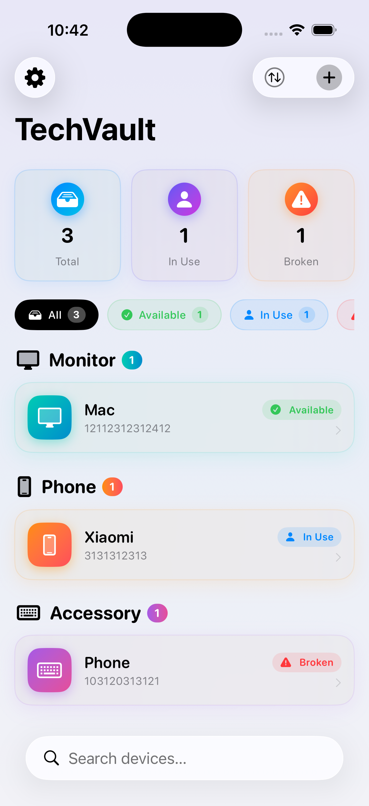
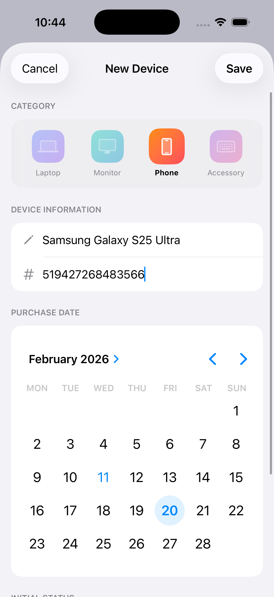
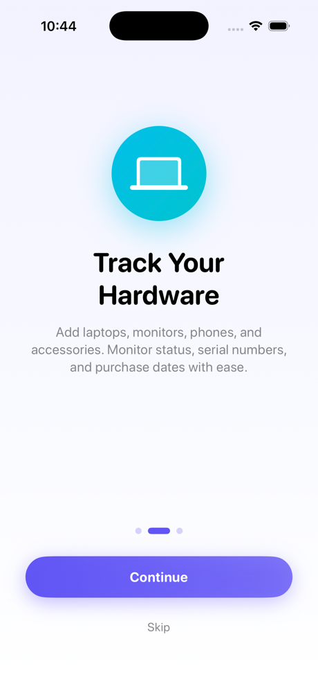
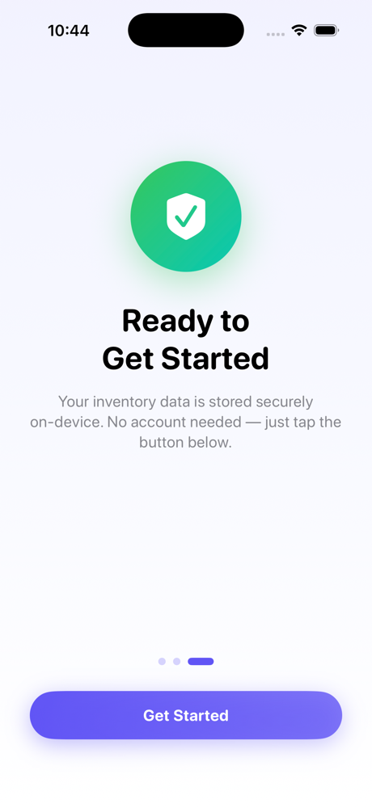
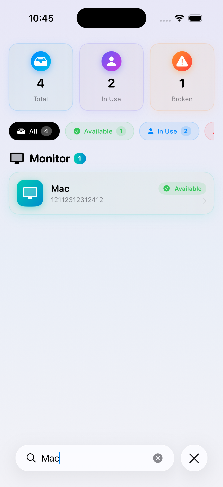

# TechVault 🔒

**Professional IT Inventory Manager** — a native iOS app for tracking hardware assets in small-to-medium businesses.

Built with **SwiftUI** + **SwiftData** (iOS 17+). No backend required — all data persists on-device.

---

## Screenshots

<p align="center">
  
  
</p>

<p align="center">
  
  
  
</p>

---

## Features

| Feature | Description |
|---------|-------------|
| 📊 **Dashboard** | Glassmorphism stat cards — Total, In Use, Broken |
| 🔍 **Search & Filter** | Real-time search + status filter pills (All / Available / In Use / Broken) |
| ↕️ **Sort** | By Name, Newest First, Oldest First, or Status |
| ➕ **Add Device** | Interactive form with visual category selector and status picker |
| ✏️ **Edit Device** | Pre-filled edit sheet — update name, serial, category, date, status |
| 🗑️ **Delete** | Swipe or tap with confirmation alert |
| 🎬 **Onboarding** | 3-slide welcome flow, shown only on first launch |
| ⚙️ **Settings** | About, Replay Onboarding, Version info |
| 📳 **Haptic Feedback** | Tactile responses on all interactive elements |
| 🎨 **Premium Design** | Gradients, glassmorphism, rounded typography, shadow depth |

---

## Tech Stack

| Layer | Technology |
|-------|-----------|
| **UI** | SwiftUI (iOS 17+) |
| **Persistence** | SwiftData (`@Model`, `@Query`) |
| **State Management** | `@AppStorage`, `@State`, `@Bindable` |
| **Design System** | SF Symbols, `.ultraThinMaterial`, `LinearGradient` |
| **Haptics** | `UIImpactFeedbackGenerator`, `UINotificationFeedbackGenerator` |

---

## Project Structure

```
IT-Inventory Manager/
├── IT_Inventory_ManagerApp.swift   # App entry point + onboarding logic
├── Item.swift                      # Device model + DeviceCategory/DeviceStatus enums
├── ContentView.swift               # All views: Dashboard, Cards, Add/Edit/Detail
├── OnboardingView.swift            # 3-page onboarding + SettingsView
└── Assets.xcassets/                # App icon and color assets
```

---

## Data Model

```swift
@Model
final class Device {
    var name: String              // e.g. "MacBook Pro 16"
    var category: DeviceCategory  // .laptop | .monitor | .phone | .accessory
    var serialNumber: String      // e.g. "C02ZX1234"
    var purchaseDate: Date
    var status: DeviceStatus      // .available | .inUse | .broken
}
```

---

## Requirements

- **Xcode 16+**
- **iOS 17.0+**
- **Swift 5.9+**

## Getting Started

```bash
git clone https://github.com/egpdev/TechVault.git
cd TechVault
open "IT-Inventory Manager.xcodeproj"
# Build & Run on iPhone Simulator (Cmd+R)
```

---

## Author

**Egor Pylkov** — Portfolio Project (Fachinformatiker für Anwendungsentwicklung)

Made with ❤️ in Germany
